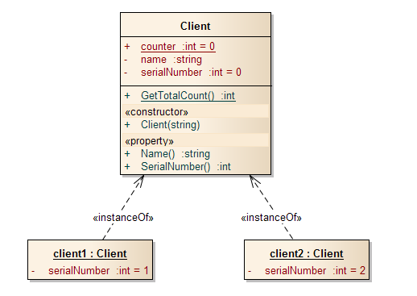
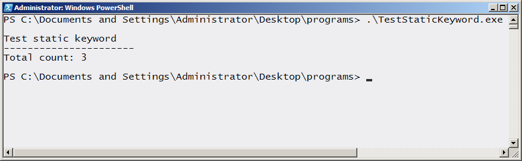
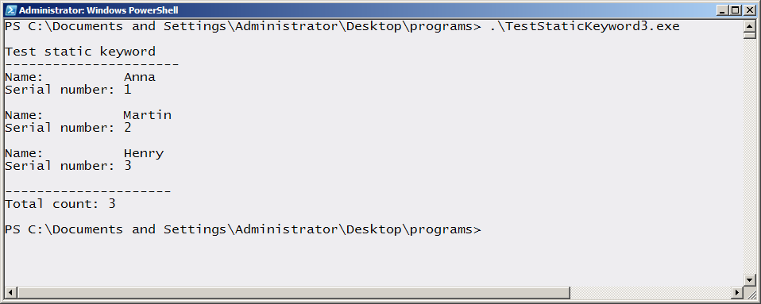

# The static keyword in C#
        

The static keyword declares members (attributes, methods) that are associated with the class rather than the instances of the class.

            Sometimes it is desirable to have a variable that is shared among all instances of a class. For example, you could use this variable as the basis for communication between instances or to keep track of the number of instances that have been created.

            You achieve this shared effect by making the variable with the keyword static. Such a variable is sometimes called a class variable to distinguish it from a member of instance variable, which is not shared.

<b>Fig1. UML Object Diagram showing the Client class and two unique instances.</b>
 

 
        

        In this example, every object that is created is assigned a unique serial number, starting at 1 and counting upwards. The variable counter is shared among all instances, so when the constructor of one object increments counter, the next object to be created receives the incremented value.
        

        
A <b>static</b> variable is similar in some ways to a global variable in other languages.

        

        If a <b>static</b> is not marked as private, you can access it from outside the class. To do this, you do not need an instance of the class, you can refer to it through the class name.
        

        

        
Sometimes you need to access program code when you do not have an instance of a particular object available. A method that is marked using the keyword <b>static</b> can be used in this way and is sometimes called a class method.

        
<b>Fig 2. Output of the program is.</b>
 
        

 
        

        You should access methods that are <b>static</b> using the class name rather than an object reference.
        

        

        Because you can invoke a <b>static</b> method without any instance of the class to which it belongs, there is no this reserved keyword applicable, because <b>static</b> variables and methods exist independently of any class objects, even when there are no objects of that class. The consequence is that a <b>static</b> method cannot access any variables other than the local variables, static attributes, and its parameters. Attempting to access non-static attributes causes a compiler error.
        

        
<b>Fig 3. Output for the complete example</b>
 
        

 
        

            You should be aware of the following when using static methods:
            <ul>
            <li>Inside the basic console application, we have the startup procedure Main. Main is defined as a <b>static</b> member, which means we do not have to have an instance of the enclosing class 
            </li>
            <li>
            Constants are considered static members. Therefore, they do not need to be-for that matter, they cannot be-marked with the <b>static</b> keyword.
            </li>
            </ul>
        

